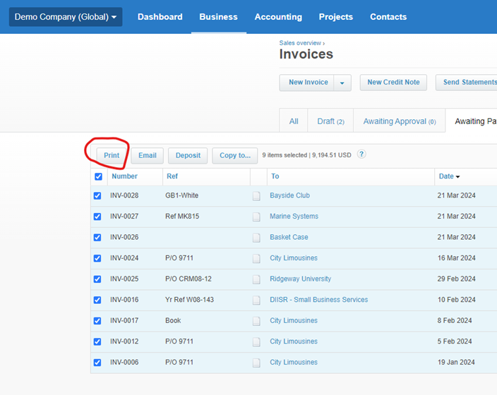

# Xero Invoice Splitter

## Background

Welcome. If you are here then that means you have encountered the pretty annoying problem in the Xero accounting software of trying to export invoices as individual PDF's in bulk, that all of the following folks have struggled with:

https://central.xero.com/s/question/0D53m00006nawMoCAI/can-i-export-invoices-as-individual-pdfs-in-bulk
https://central.xero.com/s/question/0D53m000063DqEoCAK/bulk-export-of-invoices-in-pdf
https://central.xero.com/s/question/0D53m00005mcTYrCAM/export-all-invoices
https://central.xero.com/s/question/0D53m00005ehYAjCAM/how-to-download-all-invoices-at-once

and so on..

Xero does not have good invoice export functionality in general, and the limited functionality it does have which involves selecting the invoices and hitting 'Print' (more detail below in 'Usage') combines all the invoices you have selected into one enormous PDF.

This PDF is difficult to split using regular PDF splitters because the exported invoices vary in the number of pages. This is where the Xero Invoice Splitter comes in - this app splits the single invoice PDF produced by Xero into a single PDF per invoice, no matter how many pages each invoice is made up of. It does this by inspecting the underlying structure of the PDF, and basically uncombines it. Also this way you are not uploading your confidential financial information to suspect online PDF splitters.

Apologies in advance for the crude UI, I hacked it together quickly, but it does the job.

## Installation Instructions
This app consists of a single exe that has no other dependencies. All you need to do is download the exe and click on it to run it. Windows Smart Scan will likely complain as this is not signed with an EV certificate and it is not regularly downloaded, so just hit the good old "Run Anyway".

I will release executables for Mac soon.

## Usage

### Step 1: Export the single combined PDF from Xero
For those who have not done this bit yet, here is a bit of primer. You can export all invoice types ('Paid', 'Draft', 'Awaiting Payment' etc), but you cannot do it from the All invoices tab, only from the invoice type tab. My understanding is you can export up to 500 at a time, but I have not tried that many and it may take a long time - I would suggest working with smaller batches if you can.

For example (I'm using the Demo Org), say you want to export all 'Awaiting Payment' invoices. You will go to the invoices page, and select the '[Awaiting Payment](https://go.xero.com/AccountsReceivable/Search.aspx?invoiceStatus=INVOICESTATUS/AUTHORISED)' tab

Select all the invoices and hit 'Print', which will then ask if you want to mark as 'Sent' (I usually 'Leave as is' for exports), and download all your selected invoices in one single PDF.

### Step 2: Run Xero Invoice Splitter
This part is easy. First follow the Installation Instructions above. Then double click the exe to launch - Click 'More Info' and then 'Run Anyway' if smart scan blocks it. 

Using the splitter involves clicking only three buttons. Top left click on 'Select Invoice File' to open a dialog to select the single PDF you downloaded from Xero in Step 1 - most likely in your Downloads folder still.

Click 'Select Output Folder' to open another file dialog to select the folder you want all the seperated invoice PDFs to be saved. **If you do not select something here, the splitter will just save the seperated PDFs in whichever folder the exe is located in.**

Then just click the 'Split Invoices' button, a progress bar will pop up and that's it, all done! 

Note that at the momement the splitter does not rename each separated PDF after the invoice number, as this is requires more complex and error prone parsing of the PDF text.

## Attributions 
The application icon couresty of Flaticon: <a href="https://www.flaticon.com/free-icons/document" title="document icons">Document icons created by smalllikeart - Flaticon</a>